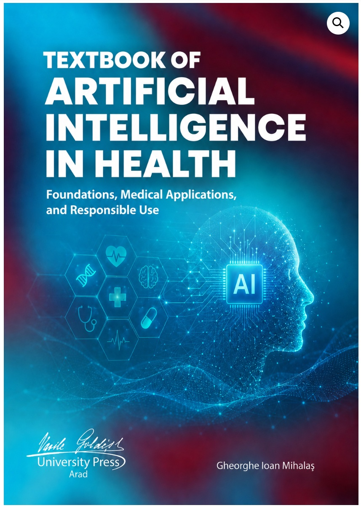
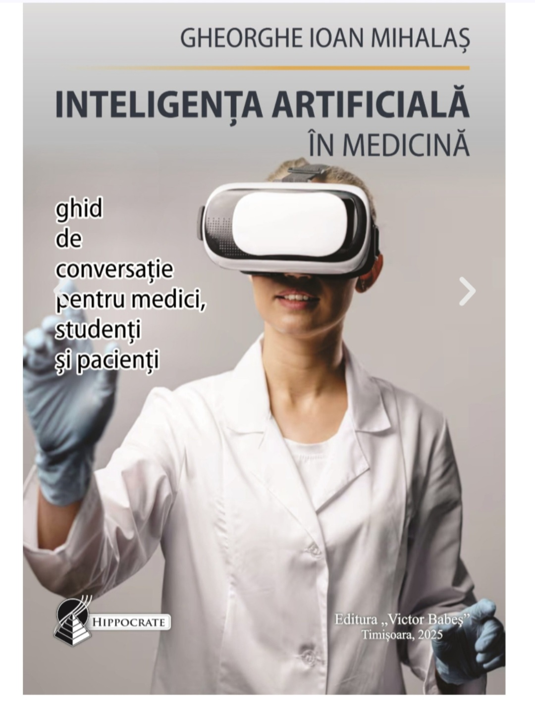

# Publications

This page presents a selected list of publications, organized by research field. Within each section, publications are grouped by type and listed in reverse chronological order.

## Artificial Intelligence in Medicine

### Books and educational volumes
- []
- *Mihalas GI. Textbook of Artificial Intelligence in Health. Foundations, Medical Applications, and Responsible Use. Vasile Goldis University Press, Arad, Romania. 2026. eISBN: 978-630-6728-62-6, https://editura.uvvg.ro/shop/cursuri/textbook-of-artificial-intelligence-in-health-foundations-medical-applications-and-responsible-use-ebook/ *
= 
- *Mihalaș GI. Inteligența Artificială în Medicină. Ghid de conversație pentru medici, studenți și pacienți. (in Romanian). Timișoara: Editura Victor Babeș, 2025, ISBN 978-606-786-473-1, https://www.researchgate.net/publication/394091288_Inteligenta_Artificiala_in_Medicina_Ghid_de_conversatie_pentru_medici_studenti_si_pacienti *

### Book chapters and conference papers
- *Mihalas GI, Boru Casiana, Cotoraci Coralia: Teaching Artificial Intelligence to Medical Students. MIE 2024, Athens, 27 Aug 2024, Stud. Health Tehnol.Inform. vol.316, 1505-1509, doi: https://doi.org/10.3233/SHTI240700*
- *Mihalas GI, Cotoraci Coralia, Boru Casiana: Integrating Artificial Intelligence in the Medical Curriculum: Approaches and Strategies. Medinfo 2025 Taipei 9-13 August 2025. Stud. Health Technol.Inform. vol.329, 1402-1406, doi: https://doi.org/10.3233/SHTI251069*
- *Mihalas GI, Goje D, Crăciun A, Lighezan D: Beyond Sequential Teaching: A Concurrent Model for AI in Medicine. MIE 2026 Genova, 25-28 May 2026. Stud. Health Technol.Inform. vol.336, 2180-2184, doi: https://doi.org/10.3233/SHTI260647*
  
### Journal articles

## Medical Informatics and Health Informatics

### Books and edited volumes

### Journal articles

### Book chapters and conference papers

## Biomedical Modeling and Decision Support

## Sonification and Auditory Display

## Biophysics and Membrane Transport

## History of Medical Informatics and Scientific Culture
